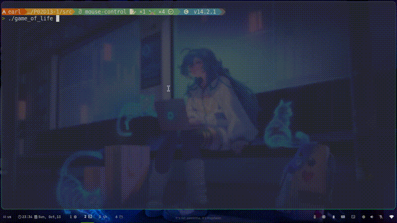

# Game of Life



This project is a simple implementation of Conway's Game of Life using the Ncurses library for terminal-based visualization. Users can select different initial states for the cellular automaton, and the program will visualize the evolution of the cells over time.

## Table of Contents

- [Features](#features)
- [Installation](#installation)
- [Usage](#usage)

## Features

- Different initial states to choose from:
  1. Moving
  2. Train  
- Terminal-based visualization using Ncurses for a colorful and interactive experience.
- Customizable simulation speed.
- Random cells at start if incorrect choice.

## Installation

To build and run this project, you need to have the `ncurses` library installed on your system. Follow the instructions below for different operating systems:

### Ubuntu/Debian

```sh
sudo apt-get install libncurses5-dev libncursesw5-dev
```

### Fedora

```sh
sudo dnf install ncurses-devel
```

### macOS

You can install ncurses using Homebrew:

```sh
brew install ncurses
```

## Building the Project

Once you have installed the required dependencies, clone this repository and build the project:

```sh
git clone ssh://git@repos-ssh.21-school.ru:2289/students/P02D13.ID_239635/Team_TL_armondte_student.21_school.ru.ac1adc6b_b617_47d9/P02D13-1.git
cd P02D13-1/src
gcc -o game_of_life game_of_life.c -lncurses
```

## Usage

To run the program, execute the following command in your terminal:

```sh
./game_of_life
```
You will be prompted to select an initial state for the simulation.

Or:

```sh
./game_of_life < glider.txt
```
Will start automatically.

### Controls
 - Select Initial State: Enter the number corresponding to the desired initial state and press `Enter`.
 - MouseLeftClick creats a new cell.
 - Exit: Close the terminal window or press `q`.
 - SpeeUp: `f`.
 - SpeedDown: `s`.
